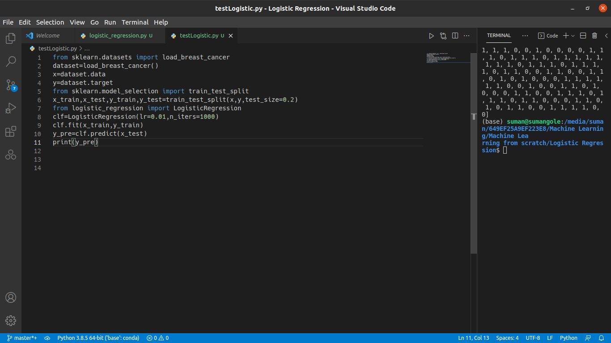

# Logistic Regression from Scratch
On my journey of 66 days of data challenge I have implemented the logistic regression using only Numpy from scratch and I tested the algorithm on Breast Cancer dataset available on Sklearn.
# Images
Code:

Test:

