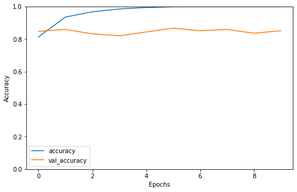
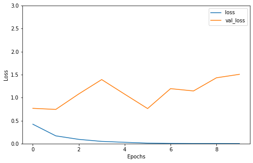

# Horse Vs. Human Classification
On my journey of 66 days of data challenge I have classified human and horse from dataset available on kaggle. I have used CNN to do the classification.
## Accuracy Vs. Validation Accuracy

## Loss Vs. Validation Loss

