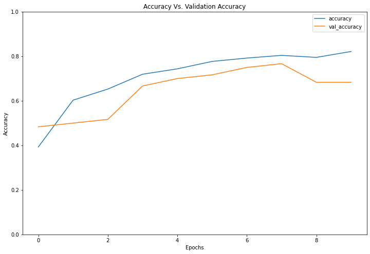
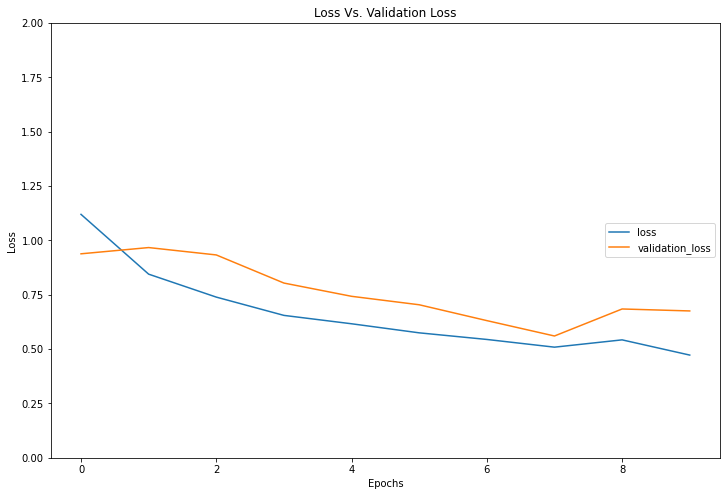

# Plant Diesease Classification
On my journey of 66 days of data challenge today I have implemented the CNN algorithm to classify whether the plants are Healthy, Powdery or Rust. In the model I have trained the model with and without the image augmentation. The model with image augmentation has showed the better results comapared to the moel without augmentation.
In the model I have used sparse categorical crossentropy as an loss for the unaugmentated model and used categorical crossentropy for the model with augmented images.
# Accuracy Vs. Validation Accuracy

# Loss vs. Validation Loss

