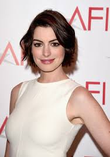
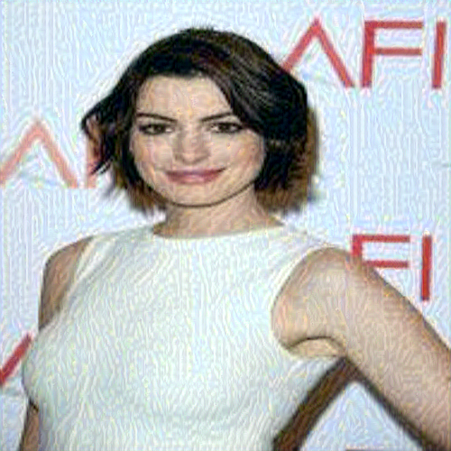
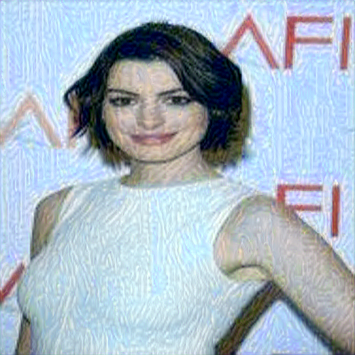

# Neural Style Transfer
On my journey of 66 days of data challenge I have implemented the neural style transfer in which I have used two images to generate the new image. 
# Original Images

# Generated Samples

